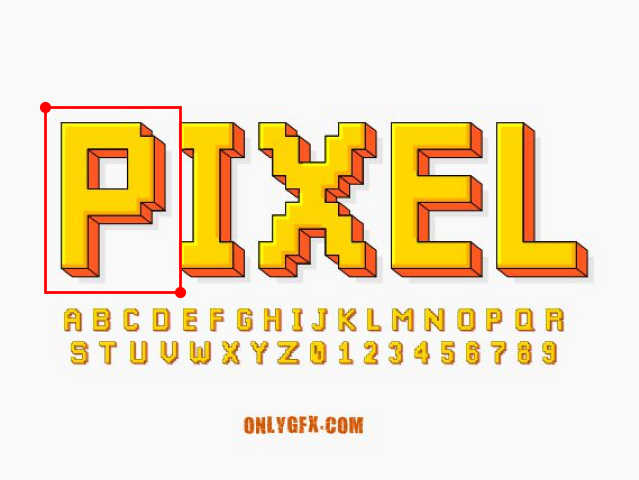
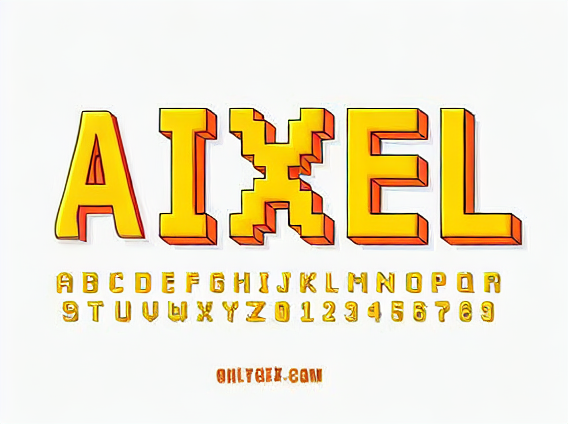
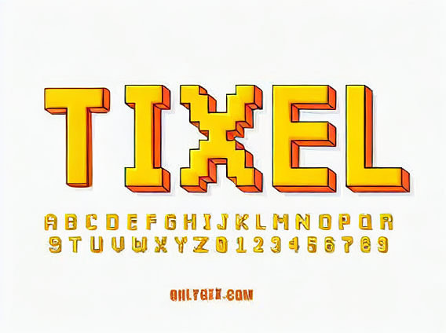
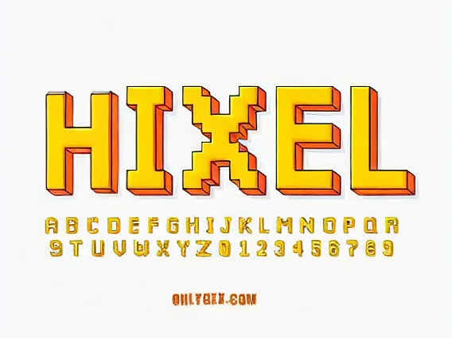

# Detextr

Detextr is a tool for repainting styled text from images using Stable Diffusion with canny edge Control-Net and font style transfer. 

## Exhibition

<center class="half">


</center>

<center class="half">


</center>

## basic usage for demo

1. for the first time, install the required packages by running the following command in the terminal:

```bash
pip install -r requirements.txt
```

2. (optional) we also provide a pre-trained Lora model for you to use. You can download it from [here](https://pan.baidu.com/s/1stHozq2PSyx8Uq309UHZFw?pwd=text) and place it in the `weights` directory.

2. download pretrained models from [TextEffects](https://pan.baidu.com/s/1stHozq2PSyx8Uq309UHZFw?pwd=text) and the example image from [exampe_image](https://pan.baidu.com/s/1stHozq2PSyx8Uq309UHZFw?pwd=text)

3. unzip the downloaded FET-GAN pre-trained model and place it in the `weights` directory.

4. unzip the downloaded FET-GAN pre-trained model and place it in the workspace as the `image_repos` directory.

5. now you should have a directory structure like this:

```
.
├── configs
├── fft
├── image_repos
├── models
├── networks
├── process
├── utils
└── weights
```

6. run the following command in the terminal( for the first time, pre-trained diffusion model would be downloaded, which may take tens of minutes):

```bash
`python detextr.py 1 1 [text effects you want to paint]`
```

7. the result will be saved as `result.png` in the workspace.

## Related works and Thanks

- [Diffuser](https://github.com/huggingface/diffusers)

- [FET-GAN](https://github.com/liweileev/FET-GAN)
